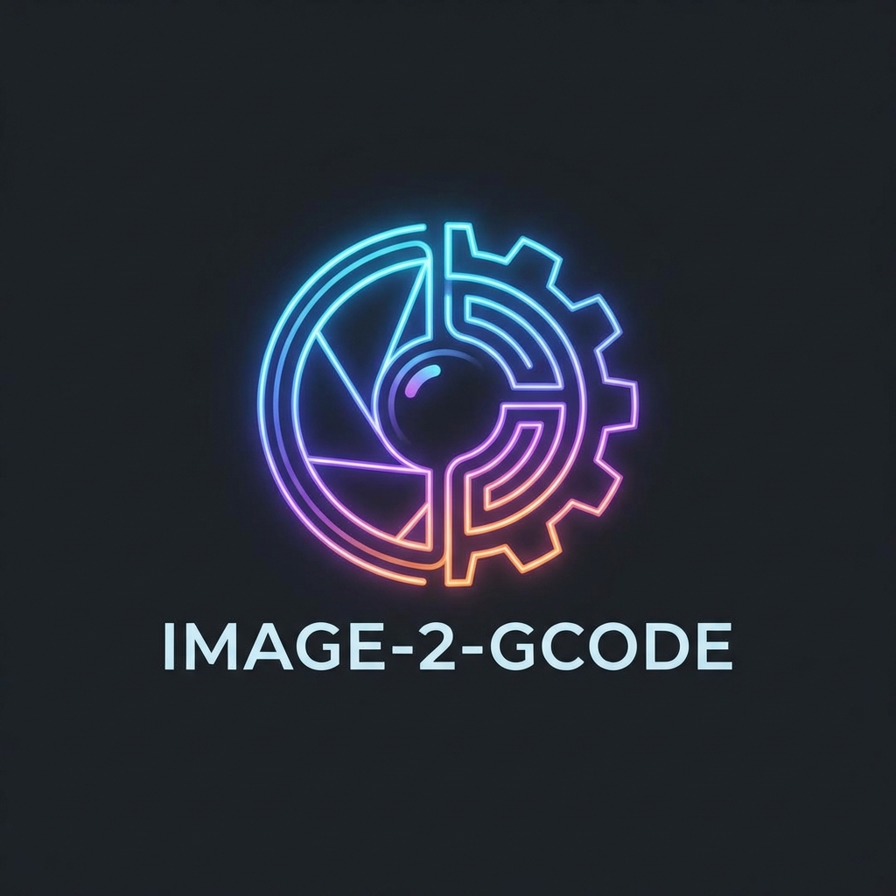
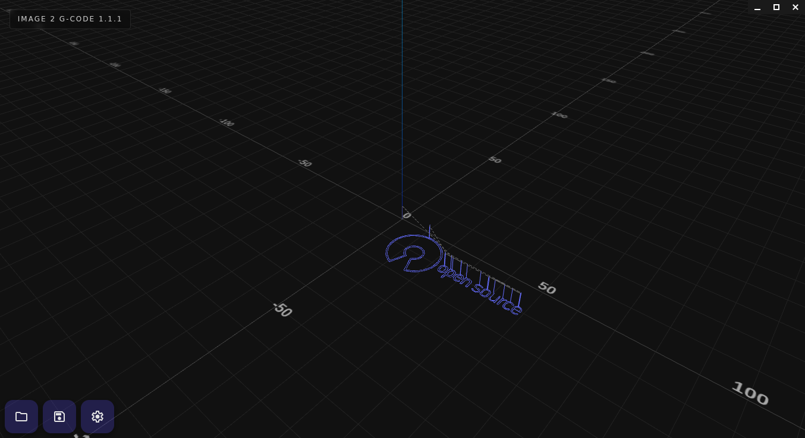

# Image2GCode


[English](README.md) | [Español](README.es.md)


**Image2GCode** es una herramienta simple y fácil de usar diseñada para convertir imágenes en G-Code, optimizada para trazadores (plotters) y máquinas CNC. 


## Screenshot



## Dev

**Backend (Python)**:
```bash
cd backend
python3 -m venv env
source env/bin/activate  
pip install -r requirements.txt
```

**Frontend (Node.js)**:
```bash
cd ..
npm install
```

**Run**:
```bash
npm run dev
```

## Package
Genera el AppImage en la carpeta `release`

```bash
chmod +x package.sh
./package.sh
```
